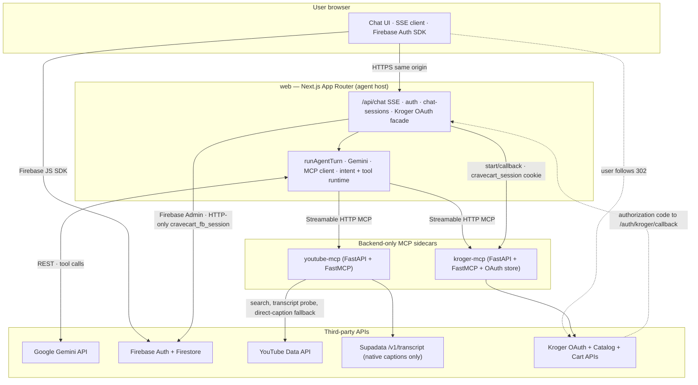
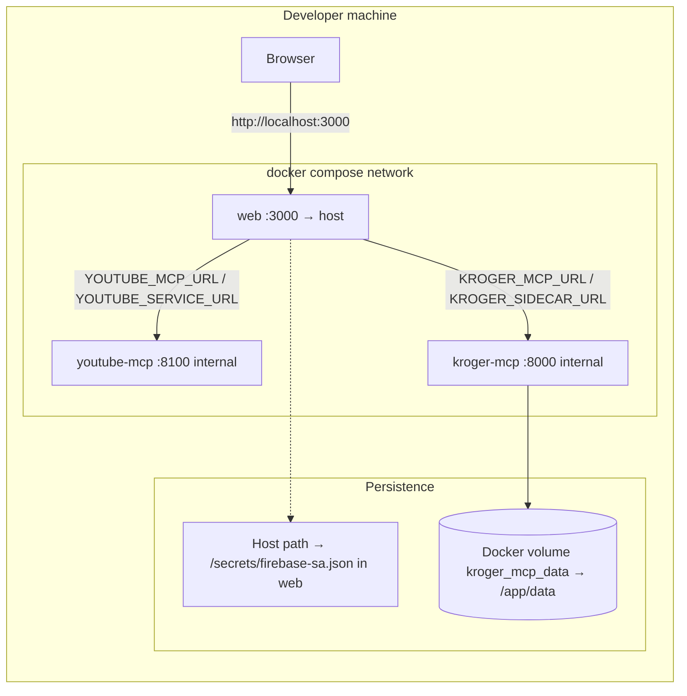
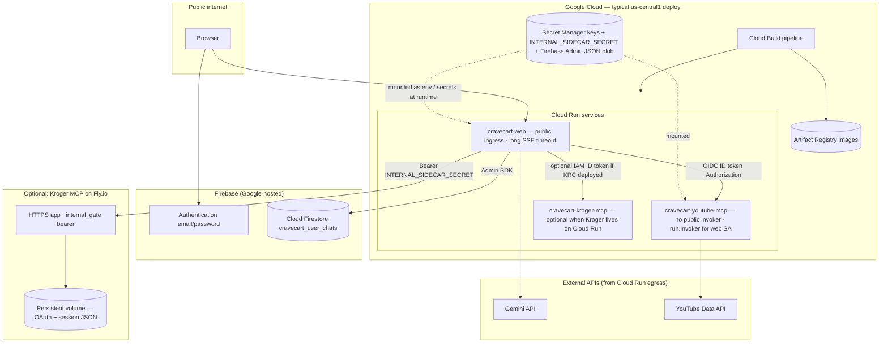

# CraveCart Architecture

CraveCart is a chat-first grocery agent that sits between a browser UI, Gemini, YouTube context, and Kroger cart APIs. The system is intentionally small, but it is not a monolith: the web app is the agent host, while YouTube and Kroger each live behind their own MCP boundary.

**Identity and saved chat:** the browser signs in with **Firebase Authentication** (email/password). The Next server exchanges the Firebase ID token for an **HTTP-only session cookie** (Firebase Admin). **Chat session metadata and messages** for signed-in users live in **Cloud Firestore** (`cravecart_user_chats`), written only through server routes; Firestore security rules deny direct client access. That is separate from **Kroger** OAuth state, which still uses the opaque `cravecart_session` cookie and file-backed storage in `kroger-mcp`.

This document explains the repo as it actually exists today: service boundaries, runtime flow, state model, auth, tool orchestration, and the current tradeoffs that matter if you are extending or operating it.

**Why the shape is interesting:** CraveCart is a small codebase that behaves like a much larger system. A single chat turn can chain **Gemini tool-calling**, **two language-agnostic MCP sidecars** (Python), **native YouTube search + transcript strategy** (probe cheap, fetch expensive paths carefully), **retail-aware product matching** (deterministic ranking over raw LLM picks), **real OAuth cart writes** (tokens never touch the browser), and **durable multi-session chat** (Firestore) — with **server-side intent policy** sitting between the model and mutations. The diagrams below are meant to match that reality, not a simplified marketing block.

## 1. System Overview

At a high level, the product promise is:

1. A user chats with one agent.
2. The agent decides whether it needs YouTube, Kroger, both, or neither.
3. The agent streams visible progress to the UI while it works.
4. If the request is actionable and properly authorized, the agent can mutate a real Kroger cart.

There are three runtime services:

- `web`: Next.js App Router app and Gemini agent host
- `youtube-mcp`: Python MCP server for video search, transcript probing, and native-caption retrieval
- `kroger-mcp`: Python MCP server for Kroger search, OAuth session state, and cart writes

The browser only talks to `web`. `web` is the only public application surface the user needs. The MCP services are backend-only dependencies.

## 2. Repo Map

These are the repo areas that matter most:

- `app/`
  - Next.js routes, layout, frontend page; Firebase sign-in UX; Kroger OAuth routes
- `components/`
  - chat UI (`LoginScreen` for Firebase auth), markdown rendering, tool activity, video/cart cards
- `lib/agent/`
  - Gemini loop, intent detection, MCP client wiring, in-memory session memory, tool runtime
- `lib/firebase/`
  - browser Firebase config fetch + session cookie `POST` helper (`clientAuth.ts`)
- `lib/server/firebase/`
  - Firebase Admin initialization (service account JSON or file path from env)
- `lib/server/auth/`
  - session user resolution (`getSessionUser`), Firebase session cookie helpers
- `lib/server/chatFirestore.ts`, `lib/server/chatTypes.ts`
  - Firestore-backed chat persistence per Firebase `uid`
- `firebase.json`, `firestore.rules`, `.firebaserc`
  - Firestore rules deployment (Admin-only data path today)
- `lib/kroger/`
  - Kroger-facing helpers used by the web host
- `lib/llm/`
  - structured ingredient extraction and schemas
- `lib/recipes/`
  - curated fallback recipes
- `youtube-mcp/`
  - standalone Python MCP server for YouTube
- `kroger-mcp/`
  - standalone Python MCP server for Kroger
- `tests/`
  - Vitest coverage for agent logic, matching, quantity estimation, carry-over, and wrappers

Key entry files:

- [app/page.tsx](app/page.tsx)
- [app/api/chat/route.ts](app/api/chat/route.ts)
- [lib/agent/runAgentTurn.ts](lib/agent/runAgentTurn.ts)
- [lib/agent/toolRuntime.ts](lib/agent/toolRuntime.ts)
- [lib/agent/gemini.ts](lib/agent/gemini.ts)
- [lib/agent/mcpClient.ts](lib/agent/mcpClient.ts)
- [youtube-mcp/app.py](youtube-mcp/app.py)
- [kroger-mcp/app.py](kroger-mcp/app.py)
- [docker-compose.yml](docker-compose.yml)

## 3. Runtime Topology

### 3.1 Logical architecture (services and trust boundaries)

This is the **authoritative** high-level picture: what talks to what, and where secrets live.

**Cookies (two different jobs):**

- **`cravecart_fb_session`** — Firebase session cookie; identifies the signed-in user for `/api/chat` and Firestore-backed history.
- **`cravecart_session`** — opaque id shared with `kroger-mcp` for Kroger OAuth state and cart token storage (not the Firebase uid).

Important boundaries:

- The **browser never receives Kroger access/refresh tokens** or Kroger client secrets; `kroger-mcp` holds token JSON per session (file-backed; see §7.5).
- **Gemini runs only on the server** (`web`); the model never calls MCP or Kroger from the client.
- **MCP sidecars do not serve HTML**; they expose MCP over HTTP and small operational/health/auth helper endpoints consumed by `web`.
- **Firestore chat** is written only through server routes with the Admin SDK; client rules deny direct reads/writes ([firestore.rules](firestore.rules)).

### 3.2 Local infrastructure (Docker Compose)

Typical laptop setup: one published port for the UI; MCP containers stay on the Compose network. Kroger session files persist in a named volume.

`INTERNAL_SIDECAR_SECRET` is optional on Compose for short internal hostnames, but when set, `web` attaches `Authorization: Bearer …` on outbound sidecar calls (see [lib/server/sidecarGatewayFetch.ts](lib/server/sidecarGatewayFetch.ts)). **Production** Cloud Run → Fly hybrid **requires** the same secret bytes on both sides ([docs/deploy-cloud-run.md](docs/deploy-cloud-run.md)).

### 3.3 Production infrastructure (GCP + Firebase + optional Fly)

The automated path is [cloudbuild.yaml](cloudbuild.yaml) → Artifact Registry → Cloud Run. **Only `cravecart-web` is public** (`--allow-unauthenticated`). YouTube MCP on Cloud Run is **IAM-invoked only**; `web` attaches a **Google ID token** (`audience` = sidecar URL). When Kroger MCP runs on **Fly.io**, `web` uses **`INTERNAL_SIDECAR_SECRET`** as a shared bearer (never sent to browsers).

`cravecart-kroger-mcp` on Cloud Run (when not using Fly) uses the same **file-backed session layout** inside the container unless you add shared storage; the Fly path keeps OAuth JSON on a **Fly volume** for persistence across restarts.

**Hybrid note:** when `_EXTERNAL_KROGER_SIDECAR_URL` is set in Cloud Build, deploy skips **`cravecart-kroger-mcp`** and points `KROGER_*_URL` at Fly ([cloudbuild.yaml](cloudbuild.yaml)). CI can pin `INTERNAL_SIDECAR_SECRET` to a **specific Secret Manager version** so Cloud Run and Fly never drift ([.github/workflows/deploy-main.yml](.github/workflows/deploy-main.yml), [scripts/ci/pin_internal_sidecar_secret_version.py](scripts/ci/pin_internal_sidecar_secret_version.py)).

After deploy, **`sync-public-urls`** sets `APP_BASE_URL` and `KROGER_REDIRECT_URI` on `web` (and on Cloud Run Kroger MCP when used) so Kroger OAuth matches the live callback.

## 4. Service Responsibilities

### 4.1 `web`

Primary files:

- [app/page.tsx](app/page.tsx)
- [app/api/chat/route.ts](app/api/chat/route.ts)
- [app/api/chat-sessions/route.ts](app/api/chat-sessions/route.ts)
- [app/api/chat-sessions/[sessionId]/route.ts](app/api/chat-sessions/[sessionId]/route.ts)
- [app/api/crave/route.ts](app/api/crave/route.ts)
- [app/api/health/route.ts](app/api/health/route.ts)
- [app/api/firebase-public-config/route.ts](app/api/firebase-public-config/route.ts)
- [app/api/auth/session/route.ts](app/api/auth/session/route.ts)
- [app/api/auth/me/route.ts](app/api/auth/me/route.ts)
- [app/api/auth/logout/route.ts](app/api/auth/logout/route.ts)
- [app/api/kroger/auth/start/route.ts](app/api/kroger/auth/start/route.ts)
- [app/auth/kroger/page.tsx](app/auth/kroger/page.tsx)
- [app/auth/kroger/callback/route.ts](app/auth/kroger/callback/route.ts)
- [app/auth/reset-password/page.tsx](app/auth/reset-password/page.tsx)

The web app is responsible for:

- rendering the chat experience (sign-in required for chat and chat-session APIs)
- streaming agent output to the browser over SSE
- holding the Gemini orchestration loop
- deciding which MCP tools are exposed to Gemini
- maintaining **in-process** session memory for conversational carry-over (`sessionState.ts`)
- persisting **per-user chat history** to Firestore for signed-in users
- enforcing cart mutation policy
- exposing the browser-facing OAuth start and callback flow for Kroger
- Firebase sign-in/sign-up/forgot-password UX and server session cookie issuance
- adapting the old one-shot `POST /api/crave` contract onto the new agent runtime

The web app is not responsible for:

- direct YouTube API calls
- direct Kroger product or cart API calls in the active path
- **shared multi-instance agent carry-over** without extra infrastructure (today’s `sessionState` is still a process-local `Map`; see §7 and deployment notes)

### 4.2 `youtube-mcp`

Primary file:

- [youtube-mcp/app.py](youtube-mcp/app.py)

This service handles:

- YouTube search normalization
- video candidate scoring
- transcript probing
- native transcript retrieval for the selected video
- honest transcript status mapping (`available`, `unavailable`, `blocked`, `error`)
- metadata packaging into MCP tool responses

Important design choice:

- CraveCart does not transcribe audio itself
- it only uses existing captions; it does not ask Supadata to generate AI transcripts
- it keeps search-time transcript probing cheap and local so every candidate does not consume transcript-provider credits
- it prefers Supadata for the final selected-video fetch because direct transcript scraping is often blocked from server or cloud IPs
- if none of the first five likely candidates expose a transcript, the system falls back to the most relevant candidate and later infers from title + description

### 4.3 `kroger-mcp`

Primary file:

- [kroger-mcp/app.py](kroger-mcp/app.py)

This service handles:

- Kroger OAuth authorization-code exchange
- Kroger client-credentials token management for product search
- per-session user token storage
- product search for a fixed configured store
- batched add-to-cart requests implemented internally as item-by-item writes
- last cart summary persistence

It exposes both:

- MCP tools for the agent host
- small HTTP endpoints used by the browser-facing auth flow

## 5. Frontend Architecture

Primary UI files:

- [app/page.tsx](app/page.tsx)
- [components/LoginScreen.tsx](components/LoginScreen.tsx) (Firebase email/password; exchanges ID token for server session)
- [components/ChatInput.tsx](components/ChatInput.tsx)
- [components/ChatMarkdown.tsx](components/ChatMarkdown.tsx)
- [components/AgentActivityPanel.tsx](components/AgentActivityPanel.tsx)
- [components/VideoResultCard.tsx](components/VideoResultCard.tsx)
- [components/CartReadyCard.tsx](components/CartReadyCard.tsx)
- [components/CartItemsList.tsx](components/CartItemsList.tsx)
- [components/KrogerAuthClient.tsx](components/KrogerAuthClient.tsx)

The frontend is a client-side transcript renderer, not a server component workflow. The main page stores chat turns in local React state as `UiMessage` objects that hold:

- role
- content
- streaming/error status
- tool traces
- optional video artifact
- optional cart artifact
- optional Kroger auth CTA

Important UI behaviors:

- the input stays docked at the bottom
- chat history grows upward like a normal assistant UI
- example prompts disappear after the first turn
- Markdown is rendered via `react-markdown` + `remark-gfm`
- tool activity is shown inline per assistant turn
- cart/video cards are turn-scoped artifacts, not global sticky panels

The frontend does not parse Gemini directly. It only consumes the server’s SSE event protocol.

## 6. Public HTTP Surface

### 6.1 `POST /api/chat`

File:

- [app/api/chat/route.ts](app/api/chat/route.ts)

Purpose:

- main agent endpoint used by the chat UI

Input:

- validated by [lib/agent/schemas.ts](lib/agent/schemas.ts)
- shape: `{ messages: ChatMessage[] }`

Behavior:

1. parse the payload
2. require a **Firebase-signed-in user** (`getSessionUser`); otherwise **401**
3. ensure the **Kroger** `cravecart_session` cookie exists (`ensureSessionId`) for MCP session affinity
4. create an SSE stream
5. call `runAgentTurn(...)`
6. stream agent events until completion

Events emitted:

- `assistant_text_delta`
- `tool_call_started`
- `tool_call_finished`
- `needs_kroger_auth`
- `cart_ready`
- `error`

### 6.2 `POST /api/crave`

Files:

- [app/api/crave/route.ts](app/api/crave/route.ts)
- [lib/api/handleCraveRequest.ts](lib/api/handleCraveRequest.ts)

Purpose:

- preserve the older hackathon “one-shot craving” API contract

This route is no longer a separate pipeline. It converts the craving into an agent instruction and runs the same Gemini + MCP path as chat.

### 6.3 `GET /api/health`

File:

- [app/api/health/route.ts](app/api/health/route.ts)

Purpose:

- expose environment and service health for local validation

It checks:

- Gemini key present
- YouTube key present
- YouTube MCP `/health`
- whether `youtube-mcp` reports `supadataConfigured`
- Kroger MCP `/health`
- whether Kroger API credentials are present in the web service env
- whether **Firebase Admin** is configured (`firebaseConfigured`)

### 6.4 Firebase identity, server session, and chat APIs

Files:

- [app/api/firebase-public-config/route.ts](app/api/firebase-public-config/route.ts) — **GET**; returns non-secret web SDK fields (`apiKey`, `projectId`, `authDomain`) when Admin + `FIREBASE_WEB_API_KEY` are configured
- [app/api/auth/session/route.ts](app/api/auth/session/route.ts) — **POST** `{ idToken }`; verifies token with Admin, sets HTTP-only **`cravecart_fb_session`** session cookie
- [app/api/auth/me/route.ts](app/api/auth/me/route.ts) — **GET**; returns `{ user }` from the session cookie (id, email, display name)
- [app/api/auth/logout/route.ts](app/api/auth/logout/route.ts) — **POST**; clears the Firebase session cookie
- [app/api/chat-sessions/route.ts](app/api/chat-sessions/route.ts) — **GET** list / **POST** bulk import; requires signed-in user; backs onto Firestore
- [app/api/chat-sessions/[sessionId]/route.ts](app/api/chat-sessions/[sessionId]/route.ts) — per-session reads/writes
- [lib/server/auth/firebaseSessionCookie.ts](lib/server/auth/firebaseSessionCookie.ts), [lib/server/firebase/admin.ts](lib/server/firebase/admin.ts)

Flow:

1. Browser loads config from `/api/firebase-public-config` and uses the Firebase JS SDK for email/password.
2. After `signInWithEmailAndPassword` (or sign-up + `updateProfile` for display name), the client posts the fresh ID token to `/api/auth/session`.
3. Chat and chat-session routes call [getSessionUser](lib/server/auth/getSessionUser.ts); unauthenticated requests get **401**.

Firestore rules ([firestore.rules](firestore.rules)) currently deny all direct client reads/writes; the server uses the Admin SDK only.

## 7. Session and persistence model

CraveCart combines **four** related ideas—do not conflate them:

| Layer | Mechanism | Purpose |
| ----- | --------- | ------- |
| **Signed-in user** | HTTP-only **`cravecart_fb_session`** (Firebase session cookie) | Who is using the app; gates `/api/chat` and `/api/chat-sessions/*` |
| **Chat history** | Firestore docs under **`cravecart_user_chats`** | Durable sidebar sessions + messages per Firebase `uid` |
| **Kroger browser session** | **`cravecart_session`** cookie ([lib/kroger/session.ts](lib/kroger/session.ts)) | Opaque id shared with `kroger-mcp` for OAuth + cart token storage |
| **Agent carry-over** | In-memory `Map` ([lib/agent/sessionState.ts](lib/agent/sessionState.ts)) | Short-lived tool/recipe/cart context for the model between turns (keyed by `cravecart_session` id) |

### 7.1 Firebase user session

- Issued only after Admin verifies the client ID token.
- Cookie options: `httpOnly`, `sameSite: lax`, `secure` in production.
- User display name comes from Firebase Auth **`displayName`** (sign-up collects first + last in the UI, stored as a single display name string).

### 7.2 Firestore chat persistence

- Implementation: [lib/server/chatFirestore.ts](lib/server/chatFirestore.ts), types in [lib/server/chatTypes.ts](lib/server/chatTypes.ts).
- The UI may still keep **localStorage** copies for migration or offline UX; the server source of truth for signed-in users is Firestore.

### 7.3 Kroger `cravecart_session` cookie

File:

- [lib/kroger/session.ts](lib/kroger/session.ts)

The web app ensures an opaque `cravecart_session` cookie exists. That value is the shared key into **Kroger MCP** session files—not the Firebase user id.

The cookie is used for:

- lookup of in-memory agent session state in `web` (via `sessionState`)
- lookup of JSON-backed Kroger OAuth state in `kroger-mcp`

### 7.4 Web agent memory (in-process)

File:

- [lib/agent/sessionState.ts](lib/agent/sessionState.ts)

The web host keeps session state in a process-local `Map` on `globalThis`.

Stored fields include:

- latest artifact
- latest cart
- latest dish
- latest recipe source
- latest recipe text
- latest extracted recipe
- pending Kroger selections
- unmatched ingredients
- timestamp

TTL:

- 6 hours

Implication:

- this is fine for **single-instance** `web` or low concurrency
- **horizontal scale** of `web` without sticky sessions or a shared store breaks carry-over for the same browser (Firestore chat still loads; mid-conversation tool context may not)
- a process restart drops this layer (Firestore chat survives)

### 7.5 Kroger MCP session storage (file-backed)

File:

- [kroger-mcp/app.py](kroger-mcp/app.py)

The Kroger service stores one JSON file per session under its `data/sessions` directory. That state contains:

- OAuth state token
- user access token
- user refresh token
- token expiry
- last cart summary
- connect timestamp

Implication:

- real cart auth survives restarts if the volume persists
- this is still an MVP persistence layer for **Kroger tokens**, not Firebase identity

## 8. Agent Runtime

The heart of the system is the Gemini loop in:

- [lib/agent/runAgentTurn.ts](lib/agent/runAgentTurn.ts)

### 8.1 High-Level Algorithm

For each user turn:

1. load session state
2. instantiate `AgentToolRuntime`
3. convert chat messages into Gemini contents
4. build a system prompt with domain routing hints
5. optionally inject carry-over server context
6. run a tool-calling loop
7. stream tool progress and text deltas
8. persist updated session state

### 8.2 Loop Structure

The loop has a hard cap:

- `MAX_TOOL_LOOPS = 48`

That is intentionally high enough for multi-step shopping flows, but still bounded so a bad model/tool interaction cannot spin forever.

On each iteration:

1. call Gemini with the current conversation state
2. inspect whether Gemini returned tool calls
3. if tool calls exist:
   - emit `tool_call_started`
   - execute each tool through `AgentToolRuntime`
   - emit `tool_call_finished`
   - append function results back into the model conversation
4. if no tool calls exist:
   - optionally auto-finalize the cart if pending selections exist
   - optionally force a follow-up response if the user asked for instructions plus shopping
   - otherwise stream the final text reply

### 8.3 Why the Runtime Owns Orchestration

Gemini chooses tools, but the runtime enforces behavior the model is not trusted to enforce alone:

- cart mutation permission
- carry-over injection
- cart auto-finalization
- recipe wrap-up generation after shopping
- auth interruption handling
- session persistence

This keeps the product agentic without making it brittle.

## 9. Prompting Strategy

Primary prompt file:

- [lib/agent/gemini.ts](lib/agent/gemini.ts)

The system prompt tells Gemini:

- it is a focused food-video and grocery agent
- it may answer ordinary questions directly with no tools
- video-first turns must not answer from search results alone
- recipe shopping should usually follow:
  - search videos
  - get video context
  - use fallback only when needed
  - extract ingredients
  - search Kroger
  - add to cart once
- transcript-backed videos are preferred
- if no transcript exists, title + description can still be used
- explicit buy intent is required before cart mutation

There is a second Gemini use:

- `generateRecipeWrapUp(...)`

That helper converts messy final shopping context into a user-facing “how to make it” response plus a short cart outcome paragraph.

## 10. Intent And Safety Layer

Primary file:

- [lib/agent/intent.ts](lib/agent/intent.ts)

This module is critical because it adds server-side policy independent of the model’s own judgment.

It detects:

- explicit buy intent
- video-first requests
- Kroger/cart requests
- carry-over shopping follow-ups
- cart status follow-ups
- video context follow-ups
- unsupported cart operations

Examples:

- `buy milk` => cart mutation allowed
- `find a good chicken alfredo video and buy the groceries` => hybrid path
- `tell me about this burger video` => no cart mutation allowed
- `delete everything in my cart` => blocked with an explanatory text response

Current unsupported cart operations:

- clear cart
- remove item
- update quantity on existing line item

Those are deliberately intercepted before the tool loop so the app fails clearly.

## 11. MCP Client Layer

Primary file:

- [lib/agent/mcpClient.ts](lib/agent/mcpClient.ts)

The web app is an MCP client for both backend services.

Implementation details:

- uses `@modelcontextprotocol/sdk`
- uses `StreamableHTTPClientTransport`
- opens one client connection per service per turn
- parses either:
  - `structuredContent`
  - JSON text responses
  - fallback raw tool result fields
- explicitly closes and attempts to terminate the session after the turn

This design keeps MCP literal in the runtime. Gemini is not simulating tools; it is driving actual MCP endpoints.

## 12. Tool Runtime Contract

Primary file:

- [lib/agent/toolRuntime.ts](lib/agent/toolRuntime.ts)

`AgentToolRuntime` is the main execution adapter between Gemini’s tool-call worldview and the real backend services.

It exposes these tools to Gemini:

- `search_youtube_videos`
- `get_video_context`
- `get_fallback_recipe`
- `extract_recipe_ingredients`
- `get_kroger_auth_status`
- `search_kroger_products`
- `add_kroger_items_to_cart`
- `get_kroger_cart_summary`

Important runtime responsibilities:

- translate MCP responses into model-friendly summaries
- maintain per-turn and per-session artifacts
- store partially matched cart selections
- merge shopping results across turns
- decide when auto-finalization is safe
- generate follow-up prompts that force completion when the model stops early

### 12.1 Why `AgentToolRuntime` Matters

Without this layer, the model would need to reason about:

- quantity estimation
- carry-over matching state
- Kroger ranking logic
- batching semantics
- auth interruption details

That would make the system less reliable. The runtime centralizes deterministic logic and lets Gemini stay high-level.

## 13. YouTube Flow

Primary file:

- [youtube-mcp/app.py](youtube-mcp/app.py)

### 13.1 Search Strategy

The YouTube MCP service does more than raw search:

1. normalize the query
2. request a wider candidate pool from YouTube
3. enrich with `videos` metadata
4. score each candidate
5. probe up to five likely candidates for transcript availability
6. prefer transcript-backed candidates
7. otherwise keep the best relevant candidate

Signals used in scoring:

- direct dish relevance
- cooking/recipe keywords
- anti-Shorts bias
- anti-roundup bias for single-dish shopping requests
- language penalties for clearly non-English candidates
- rough duration preference

### 13.2 Transcript Strategy

CraveCart does not generate transcripts itself.

It relies on:

- `youtube-transcript-api` for low-cost transcript probing during candidate ranking
- Supadata `/v1/transcript` with `mode=native` for selected-video retrieval
- direct public subtitle access only as a last-resort fallback when Supadata has a transient provider failure

The selected-video fetch flow is:

1. try Supadata in `mode=native`
2. if Supadata returns a transcript directly, clean it and return it
3. if Supadata returns an async job, poll until it completes or fails
4. if Supadata says the transcript is unavailable, report that honestly and stop
5. if Supadata transiently fails or rate-limits, try direct `youtube-transcript-api`
6. if both paths fail, return an honest `blocked` or `error` status instead of claiming there is no transcript

Important constraint:

- CraveCart does not call Supadata `mode=auto` or `mode=generate`
- if YouTube already has captions, the app should use the native caption track rather than an AI-regenerated transcript

If transcript retrieval still fails:

- the selected video is still returned
- the downstream system may use title + description inference
- or the curated fallback recipe path if one exists and the context suggests it

### 13.3 Video Context Contract

`get_video_context` returns:

- video metadata
- transcript availability
- transcript status (`available`, `unavailable`, `blocked`, `error`)
- transcript text when available
- transcript message when unavailable

The web runtime then decides how to transform that into recipe context.

## 14. Fallback Recipe Strategy

Primary file:

- [lib/recipes/fallbackRecipes.ts](lib/recipes/fallbackRecipes.ts)

Fallbacks are intentionally narrow and curated. They exist as a reliability backstop, not as the primary source of truth.

Current seeded dishes:

- American cheeseburger
- Chicken Alfredo
- Chocolate chip cookies
- Caesar salad
- Hungarian Pizza

Each fallback includes:

- human-readable recipe text
- a pre-structured `ExtractedRecipe`

This matters because the app can continue even when:

- the transcript is unavailable
- Gemini extraction fails twice
- a known demo dish needs guaranteed continuity

## 15. Ingredient Extraction

Primary files:

- [lib/llm/extractIngredients.ts](lib/llm/extractIngredients.ts)
- [lib/llm/client.ts](lib/llm/client.ts)
- [lib/llm/schemas.ts](lib/llm/schemas.ts)

The extraction path is separate from the main agent loop. Gemini uses native tool-calling for orchestration, but ingredient extraction uses a constrained JSON sub-call with schema validation.

Flow:

1. build a strict recipe extraction prompt
2. call Gemini with `responseMimeType: "application/json"`
3. parse against Zod schema
4. if parsing fails, retry once with a repair prompt
5. if it still fails and a structured fallback exists, use the fallback
6. otherwise throw

The extractor is told to:

- normalize ingredients to grocery-searchable names
- ignore cookware
- treat pantry basics as pantry items
- preserve quantities and units where possible
- infer from title/description if no transcript exists
- focus on one coherent recipe when a video contains multiple variants

## 16. Product Search And Matching

Primary files:

- [lib/kroger/searchQueries.ts](lib/kroger/searchQueries.ts)
- [lib/kroger/productMatcher.ts](lib/kroger/productMatcher.ts)
- [lib/kroger/quantityEstimator.ts](lib/kroger/quantityEstimator.ts)

This is one of the most important “deterministic over LLM” parts of the repo.

### 16.1 Query Expansion

The runtime does not blindly search Kroger with the raw ingredient string. It generates normalized candidate queries that better match real retail catalogs.

Examples of the job this layer does:

- collapse awkward LLM phrasing
- handle produce variants
- handle “or” ingredient forms
- map normalized ingredient names to grocery-friendly search terms

### 16.2 Product Ranking

The product matcher scores candidate Kroger products against the structured ingredient using signals like:

- name relevance
- category fit
- package usefulness
- generic/private-label acceptability
- lower price as a tie-breaker

There is a minimum confidence threshold:

- weak matches are discarded instead of forced

That is why the app can return partial carts rather than hallucinated success.

### 16.3 Quantity Estimation

The quantity estimator converts recipe quantity into retail package count.

Examples:

- `2 lb chicken breast` may map to 2 smaller packages or 1 larger package
- `12 oz pasta` often maps cleanly to 1 standard pasta box
- ambiguous size metadata falls back to `1`

This layer is heuristic and intentionally conservative.

## 17. Kroger Flow

Primary files:

- [lib/kroger/KrogerClient.ts](lib/kroger/KrogerClient.ts)
- [kroger-mcp/app.py](kroger-mcp/app.py)

### 17.1 Search

Product search uses Kroger client credentials, not the user’s OAuth token.

That lets the app:

- search products before the user connects Kroger
- build a draft shopping plan
- stop at auth only when cart mutation is needed

### 17.2 Cart Writes

Cart writes require:

- explicit buy intent in the latest user turn
- a connected Kroger session

The add-to-cart tool accepts a batch, but `kroger-mcp` writes each item one by one with `PUT /cart/add`. This lets the app:

- return per-item success/failure
- keep partial progress
- persist a last cart summary

### 17.3 Last Cart Summary

The Kroger service stores a session-level last cart summary. The web app can query it through `get_kroger_cart_summary` if needed.

## 18. Kroger OAuth Model

Files:

- [app/api/kroger/auth/start/route.ts](app/api/kroger/auth/start/route.ts)
- [app/auth/kroger/page.tsx](app/auth/kroger/page.tsx)
- [app/auth/kroger/callback/route.ts](app/auth/kroger/callback/route.ts)
- [kroger-mcp/app.py](kroger-mcp/app.py)

Flow:

1. browser asks `web` to start auth
2. `web` ensures the session cookie exists
3. `web` calls `kroger-mcp /auth/start`
4. `kroger-mcp` generates and stores an OAuth `state`
5. browser is redirected to Kroger
6. Kroger redirects back to `/auth/kroger/callback`
7. `web` forwards `code` and `state` to `kroger-mcp /auth/callback`
8. `kroger-mcp` exchanges the code for tokens and stores them under the session

Important properties:

- tokens never go to the browser
- browser and backend state are stitched together by `cravecart_session`
- redirect URI must match the Kroger app configuration exactly

## 19. Kroger integration

Kroger product search and cart writes always use the live Kroger API. Configure `KROGER_CLIENT_ID`, `KROGER_CLIENT_SECRET`, `KROGER_REDIRECT_URI`, and `KROGER_LOCATION_ID` in every environment (local, compose, Cloud Run).

## 20. Compatibility Wrapper

Primary file:

- [lib/api/handleCraveRequest.ts](lib/api/handleCraveRequest.ts)

The old MVP shape still exists for `POST /api/crave`, but it is now just a translator:

- normalizes the craving
- builds an explicit agent instruction
- runs the same `runAgentTurn(...)`
- maps the final cart artifact back to the old JSON contract

This preserves the original demo API without maintaining two execution engines.

## 21. Event Streaming Model

The server emits low-level incremental events, but the UI turns them into cohesive turn artifacts.

Streaming event types are defined in:

- [lib/types.ts](lib/types.ts)

The frontend:

- appends `assistant_text_delta` into the active assistant bubble
- appends tool traces to the activity panel
- derives video artifacts from `get_video_context`
- stores cart artifacts only for the turn that produced them

This is why a later message like `1+1?` does not keep showing an old cart card.

## 22. Carry-Over Behavior

One of the more subtle parts of the repo is the way follow-up turns reuse context.

Examples of supported follow-ups:

- `buy them for me`
- `did you buy all the ingredients`
- `how did he make it`
- `what ingredients were in it`

The web agent handles these by injecting server-generated carry-over prompts into Gemini when appropriate, rather than hoping the browser chat transcript alone is enough.

This matters because:

- tool results are richer than what the assistant text alone says
- the saved recipe/cart/video context is normalized
- follow-up turns can skip redundant tool calls

## 23. Deployment Shape

**Diagrams:** local Compose and production GCP/Firebase/Fly topology are drawn in §3.2 and §3.3 under [Runtime Topology](#3-runtime-topology).

Primary files:

- [docker-compose.yml](docker-compose.yml)
- [Dockerfile](Dockerfile) (Next **standalone**; runtime **`USER nextjs`**)
- [youtube-mcp/Dockerfile](youtube-mcp/Dockerfile)
- [kroger-mcp/Dockerfile](kroger-mcp/Dockerfile)
- [cloudbuild.yaml](cloudbuild.yaml), [docs/deploy-cloud-run.md](docs/deploy-cloud-run.md)

Recommended baseline deployment:

- one `web`
- one `youtube-mcp`
- one `kroger-mcp`
- one persistent volume for Kroger session data
- Firebase project with **Authentication** (email/password), **Firestore**, and Admin credentials mounted as **`FIREBASE_SERVICE_ACCOUNT_JSON`** (Cloud Run) or **`FIREBASE_SERVICE_ACCOUNT_PATH`** / Compose host mount (see [README](./README.md))

Compose note: **`FIREBASE_SERVICE_ACCOUNT_HOST_PATH`** binds the Admin JSON into `/secrets/firebase-sa.json` inside `web`; production typically uses Secret Manager instead.

This repo is well-suited to:

- local development
- demo environments
- a single-instance hosted beta (simplest correctness story for agent carry-over)

Firestore-backed **accounts and chat** can scale across multiple `web` instances once requests can reach any instance; **`sessionState` (agent carry-over)** is still **per-process** unless you externalize it (Redis/Firestore/affinity).

It is not yet well-suited to:

- **horizontally scaled `web`** with **sticky tool carry-over** and no shared store for `sessionState`
- stateless multi-instance Kroger **MCP** scaling without moving session files to shared storage

Firebase provides **hosted multi-user identity**; remaining scale limits are agent memory + Kroger file sessions, not Firebase login.

## 24. Environment Contract

Primary files:

- [lib/env.ts](lib/env.ts)
- [.env.example](.env.example) (authoritative list for local/Compose)

Important envs:

- `GEMINI_API_KEY`
- `GEMINI_MODEL`
- `YOUTUBE_API_KEY`
- `SUPADATA_API_KEY` — recommended; mounted into `youtube-mcp` for native public-caption retrieval
- `KROGER_CLIENT_ID`
- `KROGER_CLIENT_SECRET`
- `KROGER_REDIRECT_URI`
- `KROGER_LOCATION_ID`
- `APP_BASE_URL`
- `INTERNAL_SIDECAR_SECRET` — required when MCP sidecars enforce bearer/auth between services (matches GCP Secret **`INTERNAL_SIDECAR_SECRET`** in Cloud Run flows)

Firebase (required for prod parity auth + chat persistence):

- `FIREBASE_WEB_API_KEY`
- **`FIREBASE_SERVICE_ACCOUNT_JSON`** OR **`FIREBASE_SERVICE_ACCOUNT_PATH`** (Admin SDK JSON)
- Compose-only host bind: **`FIREBASE_SERVICE_ACCOUNT_HOST_PATH`** (see [docker-compose.yml](docker-compose.yml))
- Optional: `FIREBASE_PROJECT_ID`, `FIREBASE_AUTH_DOMAIN` when not inferred or when Auth domain differs from `{projectId}.firebaseapp.com`

Optional service overrides:

- `YOUTUBE_MCP_URL`
- `YOUTUBE_SERVICE_URL`
- `KROGER_MCP_URL`
- `KROGER_SIDECAR_URL`

Defaults assume Docker Compose internal networking.

## 25. Testing Strategy

Test entry points:

- [tests](tests)
- [kroger-mcp/test_smoke.py](kroger-mcp/test_smoke.py)

The current suite focuses on the places where agentic systems usually break:

- intent gating
- carry-over reuse
- wrapper mapping
- schema validation and repair
- deterministic product ranking
- quantity estimation
- UI activity trace normalization
- Kroger MCP auth and cart aggregation smoke tests

This is an important pattern in the repo:

- Gemini handles choice and synthesis
- deterministic code handles validation, state, ranking, and policy
- tests focus on the deterministic layer

## 26. Current Tradeoffs

This repo is deliberately pragmatic. The main compromises are:

- transcript retrieval is best-effort
- title/description inference can be imperfect when transcripts are missing
- **tool carry-over** (`sessionState`) is **in-memory per `web` process** (Firestore chat survives restarts and scales separately)
- Kroger session storage for OAuth tokens is **file-backed** in `kroger-mcp`
- cart mutation support is add-only in the live path
- quantity estimation is heuristic
- Firebase stores **identity + display name + chat docs**; there is **no bespoke user table** beyond Firebase/Firestore

Those are acceptable for the current product stage because the architecture is optimizing for:

- visible agentic behavior
- real tool boundaries
- live cart usefulness
- simple deployment
- credible sign-in without operating a passwords database yourself

## 27. Extension Points

If you want to extend the system, these are the cleanest seams:

### Add more fallback recipes

- [lib/recipes/fallbackRecipes.ts](lib/recipes/fallbackRecipes.ts)

### Add more tool-level intelligence

- [lib/agent/toolRuntime.ts](lib/agent/toolRuntime.ts)
- [lib/agent/intent.ts](lib/agent/intent.ts)

### Improve product matching

- [lib/kroger/productMatcher.ts](lib/kroger/productMatcher.ts)
- [lib/kroger/searchQueries.ts](lib/kroger/searchQueries.ts)
- [lib/kroger/quantityEstimator.ts](lib/kroger/quantityEstimator.ts)

### Add new MCP domains

- [lib/agent/mcpClient.ts](lib/agent/mcpClient.ts)
- [lib/agent/gemini.ts](lib/agent/gemini.ts)

### Replace MVP persistence

- [lib/agent/sessionState.ts](lib/agent/sessionState.ts) — Redis/Memorystore/Firestore keyed by `cravecart_session` id for multi-instance `web`
- [kroger-mcp/app.py](kroger-mcp/app.py) — shared object store or volume instead of local `data/sessions`
- [lib/server/chatFirestore.ts](lib/server/chatFirestore.ts) — tighten rules/indexes if you open client-direct reads later

## 28. Mental Model For Contributors

If you are new to the repo, the correct mental model is:

- `page.tsx` is the chat shell; **Firebase sign-in** gates chat
- `/api/firebase-public-config` + `/api/auth/session` establish the server-side user session cookie
- `/api/chat-sessions*` mirror chat to **Firestore** for signed-in users
- `/api/chat` is the streamed execution gateway (**401** until signed in)
- `runAgentTurn.ts` is the agent brainstem
- `toolRuntime.ts` is the deterministic orchestration core
- `youtube-mcp` is the video/transcript provider
- `kroger-mcp` is the store/cart provider (still keyed by `cravecart_session`)

Gemini decides what to do next. The runtime decides what Gemini is allowed to do, how tool results are persisted, and how the product keeps working when the world is messy.
