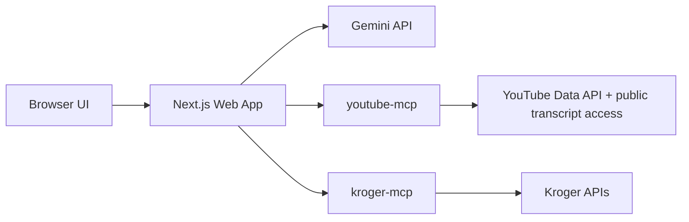

# CraveCart Architecture

## Overview

CraveCart is a chat-first food and grocery agent built as a small multi-service system:

- `web`: Next.js App Router app that hosts the UI, Gemini agent loop, SSE chat API, and browser-facing Kroger OAuth routes
- `youtube-mcp`: Python MCP service for YouTube video search and best-effort transcript retrieval
- `kroger-mcp`: Python MCP service for Kroger product search, customer auth state, and cart mutations

The product model is:

1. The browser talks only to the `web` app.
2. The `web` app runs the Gemini tool-calling loop.
3. Gemini chooses between YouTube tools, Kroger tools, or both.
4. The `web` app calls MCP tools on the backend services.
5. The UI renders streamed text, tool activity, video context, and cart results.

## Runtime Topology

### Service Responsibilities

#### `web`

Main files:

- [C:\Users\mousa\Desktop\HACKATHON 2026 APRIL\cravecart\app\page.tsx](C:\Users\mousa\Desktop\HACKATHON%202026%20APRIL\cravecart\app\page.tsx)
- [C:\Users\mousa\Desktop\HACKATHON 2026 APRIL\cravecart\app\api\chat\route.ts](C:\Users\mousa\Desktop\HACKATHON%202026%20APRIL\cravecart\app\api\chat\route.ts)
- [C:\Users\mousa\Desktop\HACKATHON 2026 APRIL\cravecart\lib\agent\runAgentTurn.ts](C:\Users\mousa\Desktop\HACKATHON%202026%20APRIL\cravecart\lib\agent\runAgentTurn.ts)
- [C:\Users\mousa\Desktop\HACKATHON 2026 APRIL\cravecart\lib\agent\toolRuntime.ts](C:\Users\mousa\Desktop\HACKATHON%202026%20APRIL\cravecart\lib\agent\toolRuntime.ts)

Responsibilities:

- render the chat UI
- stream agent events to the browser over SSE
- host the Gemini tool loop
- maintain lightweight per-session agent state in memory
- enforce cart mutation guards
- expose browser-facing Kroger OAuth routes

#### `youtube-mcp`

Main file:

- [C:\Users\mousa\Desktop\HACKATHON 2026 APRIL\cravecart\youtube-mcp\app.py](C:\Users\mousa\Desktop\HACKATHON%202026%20APRIL\cravecart\youtube-mcp\app.py)

Responsibilities:

- normalize search queries for recipe/video lookups
- search YouTube for likely recipe videos
- probe up to five strong candidates for transcript availability
- prefer transcript-backed videos when available
- return video metadata and transcript context

#### `kroger-mcp`

Main file:

- [C:\Users\mousa\Desktop\HACKATHON 2026 APRIL\cravecart\kroger-mcp\app.py](C:\Users\mousa\Desktop\HACKATHON%202026%20APRIL\cravecart\kroger-mcp\app.py)

Responsibilities:

- hold Kroger client credentials and user OAuth tokens server-side
- search Kroger products for a fixed configured location
- add items to the user cart
- store per-session Kroger auth state on disk
- expose MCP cart/search tools plus small HTTP auth endpoints

## Chat And Agent Flow

### 1. Browser Request

The browser posts chat history to:

- [C:\Users\mousa\Desktop\HACKATHON 2026 APRIL\cravecart\app\api\chat\route.ts](C:\Users\mousa\Desktop\HACKATHON%202026%20APRIL\cravecart\app\api\chat\route.ts)

This route:

- ensures a `cravecart_session` cookie exists
- starts an SSE response
- invokes `runAgentTurn(...)`

### 2. Agent Loop

The core loop lives in:

- [C:\Users\mousa\Desktop\HACKATHON 2026 APRIL\cravecart\lib\agent\runAgentTurn.ts](C:\Users\mousa\Desktop\HACKATHON%202026%20APRIL\cravecart\lib\agent\runAgentTurn.ts)

The loop:

1. builds a system prompt from the latest user message
2. restores carry-over state when follow-up turns refer to prior recipe or cart context
3. sends chat history and tool declarations to Gemini
4. executes returned tool calls via `AgentToolRuntime`
5. streams `tool_call_started`, `tool_call_finished`, and `assistant_text_delta`
6. emits `cart_ready`, `needs_kroger_auth`, or `error` terminal events when appropriate

### 3. Tool Runtime

The tool execution layer lives in:

- [C:\Users\mousa\Desktop\HACKATHON 2026 APRIL\cravecart\lib\agent\toolRuntime.ts](C:\Users\mousa\Desktop\HACKATHON%202026%20APRIL\cravecart\lib\agent\toolRuntime.ts)

It provides Gemini with a stable tool surface:

- `search_youtube_videos`
- `get_video_context`
- `get_fallback_recipe`
- `extract_recipe_ingredients`
- `get_kroger_auth_status`
- `search_kroger_products`
- `add_kroger_items_to_cart`
- `get_kroger_cart_summary`

This layer also owns:

- session-scoped saved recipe/cart/video context
- product ranking
- quantity estimation
- cart auto-finalization when the model finishes matching ingredients

## Transcript Strategy

CraveCart does not transcribe audio itself.

Current strategy:

1. Search YouTube for relevant English recipe videos.
2. Probe up to five likely candidates for accessible captions.
3. If any have transcripts, prefer those videos.
4. If none do, use the most relevant result anyway.
5. When no transcript exists, infer recipe context from the video title and description.

That logic lives mainly in:

- [C:\Users\mousa\Desktop\HACKATHON 2026 APRIL\cravecart\youtube-mcp\app.py](C:\Users\mousa\Desktop\HACKATHON%202026%20APRIL\cravecart\youtube-mcp\app.py)
- [C:\Users\mousa\Desktop\HACKATHON 2026 APRIL\cravecart\lib\llm\extractIngredients.ts](C:\Users\mousa\Desktop\HACKATHON%202026%20APRIL\cravecart\lib\llm\extractIngredients.ts)

## Shopping Flow

For recipe shopping turns:

1. Gemini selects a video.
2. `get_video_context` loads transcript or description-based context.
3. `extract_recipe_ingredients` converts recipe context into structured grocery data.
4. `search_kroger_products` matches each non-pantry ingredient.
5. `add_kroger_items_to_cart` performs a single batched cart mutation when the user explicitly wants to buy.

Relevant files:

- [C:\Users\mousa\Desktop\HACKATHON 2026 APRIL\cravecart\lib\kroger\productMatcher.ts](C:\Users\mousa\Desktop\HACKATHON%202026%20APRIL\cravecart\lib\kroger\productMatcher.ts)
- [C:\Users\mousa\Desktop\HACKATHON 2026 APRIL\cravecart\lib\kroger\quantityEstimator.ts](C:\Users\mousa\Desktop\HACKATHON%202026%20APRIL\cravecart\lib\kroger\quantityEstimator.ts)
- [C:\Users\mousa\Desktop\HACKATHON 2026 APRIL\cravecart\lib\kroger\searchQueries.ts](C:\Users\mousa\Desktop\HACKATHON%202026%20APRIL\cravecart\lib\kroger\searchQueries.ts)

## Session And Auth Model

### Browser Session

The web app uses an opaque cookie:

- [C:\Users\mousa\Desktop\HACKATHON 2026 APRIL\cravecart\lib\kroger\session.ts](C:\Users\mousa\Desktop\HACKATHON%202026%20APRIL\cravecart\lib\kroger\session.ts)

That cookie keys:

- in-memory agent context in the web app
- persisted Kroger auth state in the Kroger MCP service

### Kroger OAuth

Browser-facing routes:

- [C:\Users\mousa\Desktop\HACKATHON 2026 APRIL\cravecart\app\auth\kroger\page.tsx](C:\Users\mousa\Desktop\HACKATHON%202026%20APRIL\cravecart\app\auth\kroger\page.tsx)
- [C:\Users\mousa\Desktop\HACKATHON 2026 APRIL\cravecart\app\auth\kroger\callback\route.ts](C:\Users\mousa\Desktop\HACKATHON%202026%20APRIL\cravecart\app\auth\kroger\callback\route.ts)
- [C:\Users\mousa\Desktop\HACKATHON 2026 APRIL\cravecart\app\api\kroger\auth\start\route.ts](C:\Users\mousa\Desktop\HACKATHON%202026%20APRIL\cravecart\app\api\kroger\auth\start\route.ts)

Kroger tokens never go to the browser. They stay inside `kroger-mcp`.

## Safety And Control Boundaries

### Cart Mutation Guard

CraveCart does not let Gemini mutate the cart on vague intent alone.

The explicit buy-intent guard lives in:

- [C:\Users\mousa\Desktop\HACKATHON 2026 APRIL\cravecart\lib\agent\intent.ts](C:\Users\mousa\Desktop\HACKATHON%202026%20APRIL\cravecart\lib\agent\intent.ts)

Examples:

- `buy milk` can mutate the cart
- `tell me about this burger video` cannot mutate the cart

### Unsupported Cart Operations

Kroger’s public cart support in this app is add-focused. Removing items, clearing the cart, and changing line-item quantities are not implemented against live Kroger cart APIs in this repo.

## Frontend Rendering Model

The UI keeps a local chat transcript in the browser and renders each assistant turn with its own scoped artifacts:

- chat markdown
- tool activity
- video card
- cart card
- auth CTA

Main files:

- [C:\Users\mousa\Desktop\HACKATHON 2026 APRIL\cravecart\app\page.tsx](C:\Users\mousa\Desktop\HACKATHON%202026%20APRIL\cravecart\app\page.tsx)
- [C:\Users\mousa\Desktop\HACKATHON 2026 APRIL\cravecart\components\ChatMarkdown.tsx](C:\Users\mousa\Desktop\HACKATHON%202026%20APRIL\cravecart\components\ChatMarkdown.tsx)
- [C:\Users\mousa\Desktop\HACKATHON 2026 APRIL\cravecart\components\AgentActivityPanel.tsx](C:\Users\mousa\Desktop\HACKATHON%202026%20APRIL\cravecart\components\AgentActivityPanel.tsx)
- [C:\Users\mousa\Desktop\HACKATHON 2026 APRIL\cravecart\components\VideoResultCard.tsx](C:\Users\mousa\Desktop\HACKATHON%202026%20APRIL\cravecart\components\VideoResultCard.tsx)
- [C:\Users\mousa\Desktop\HACKATHON 2026 APRIL\cravecart\components\CartReadyCard.tsx](C:\Users\mousa\Desktop\HACKATHON%202026%20APRIL\cravecart\components\CartReadyCard.tsx)

## Deployment Shape

Local and simple hosted deployments use:

- [C:\Users\mousa\Desktop\HACKATHON 2026 APRIL\cravecart\docker-compose.yml](C:\Users\mousa\Desktop\HACKATHON%202026%20APRIL\cravecart\docker-compose.yml)

Recommended baseline:

- one `web` instance
- one `youtube-mcp` instance
- one `kroger-mcp` instance
- a persistent volume for Kroger auth state

This is still a lightweight architecture intended for MVP and small-scale use.

## Testing

Important verification paths are covered by:

- [C:\Users\mousa\Desktop\HACKATHON 2026 APRIL\cravecart\tests](C:\Users\mousa\Desktop\HACKATHON%202026%20APRIL\cravecart\tests)
- [C:\Users\mousa\Desktop\HACKATHON 2026 APRIL\cravecart\kroger-mcp\test_smoke.py](C:\Users\mousa\Desktop\HACKATHON%202026%20APRIL\cravecart\kroger-mcp\test_smoke.py)

Core checks:

- intent routing
- carry-over behavior
- ingredient extraction repair flow
- product ranking guards
- quantity estimation
- activity rendering
- `/api/crave` compatibility mapping
- Kroger MCP smoke behavior

## Known Tradeoffs

- transcript coverage is best-effort and depends on accessible public captions
- when transcripts are missing, recipe extraction falls back to video metadata inference
- chat history is client-side only; there is no user account system in the web app
- agent session context in the web app is in-memory, so it is not a horizontally scaled multi-instance design yet
- Kroger auth state in `kroger-mcp` is file-backed, not database-backed
